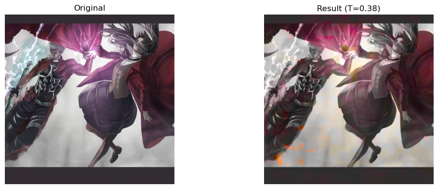
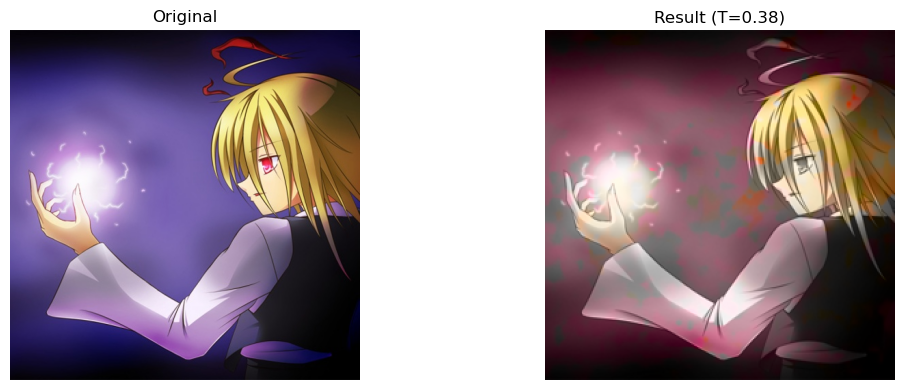
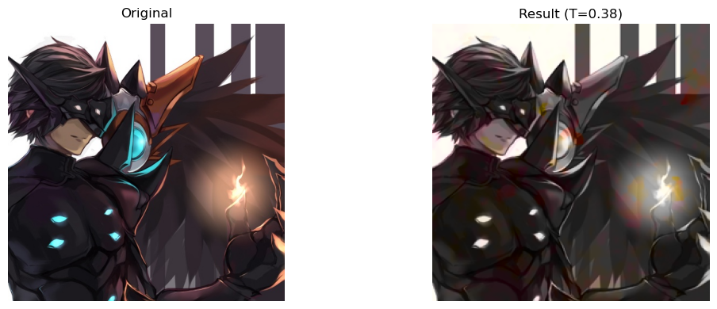

# Manga-Colouring

## Overview: The problem of colourising Manga or similarly inspired artwork. Given the L channel, the model tries to predict the A and B channel.

The project is inspired from the paper [Colorful Image Colorization](https://arxiv.org/abs/1603.08511) by Richard Zhang, Phillip Isola and Alexei A. Efros.
The model proposed by them is trained for ImageNet Dataset so I wanted to explore how well it will do on some other application like colourising Manga or anime inspired artwork.

## Model Details:
The model is a Convolutional Neural Network designed to predict the ‘a’ and ‘b’ channels of the Lab color space given the ‘L’ channel.
The paper treats this problem as a classification problem rather than a regression problem.

The colours from the dataset are quantised and converted into classes. The quantisation process is implemented in the `quantisaion.py`.

A custom loss function, derivative of the Categorical Crossentropy Loss, is implemented to train the model which employs techniques like weighting to balance the training and overrepresent some less prominent colours.

### Evaluation Metrics:
In the paper the team has employed a process similar to Turing Test to evaluate the model, but in this process I try to evaluate my model on some quantitative metrics like Mean Squared Error (MSE), Mean Absolute Error (MAE) and Peak Signal to Noise Ratio (PSNR).

For all other specific details you can refer to the original paper.

### Dataset:

The proposed architecture is trained on the a custom dataset of anime inspired artwork. The dataset is created by fetching the images from the image hosting website, Danbooru. This site is ideal for this task since it is essentially a large-scale crowdsource and tagged anime dataset with nearly 4 million anime images.

In the `data_download.py`, I downloaded approx 10,000 images (at 1 image per second) with fantasy inspired tags like _magic_, *holding_staff*, etc. After this the images were further processed and resized into a 256 X 256 square.

## Results:
The model performs fairly well with mse of 0.0012, mae of 0.0034 and psnr of 37.

Below are some results that are indicative of how the model performs on manga-esque art.

  
  
  

### Interpretation and improvements:

The model is correctly able to identify the areas to colour but not the correct colours in many instances, which can be due to the lack in diversity in colours in the dataset, this should be improved by training on a larger dataset.

This performance is definitely not on par with the performance on ImageNet which demonstrate the need for Generative architectures. For anyone intersted in that, can refer to the paper [Image-to-Image Translation with Conditional Adversarial Networks](https://arxiv.org/abs/1611.07004) by Isola et al.

